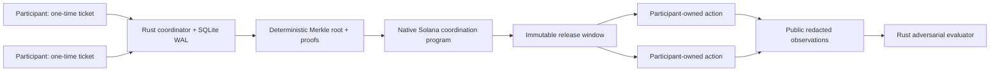

# mirror-pool

mirror-pool is a Rust-only, non-custodial behavioral coordination network for Solana. Independent participants voluntarily join a round, verify their inclusion, build and sign their own allowlisted action, and target the same bounded execution window. No participant funds enter the coordination program or coordinator.

This project implements Superteam Brasil's [Privacy-Through-Noise bounty](https://superteam.fun/earn/listing/noise/). It is production-oriented protocol software, but it is **not audited and is not mainnet-ready**.

## What it is—and is not

It coordinates timing and canonical instruction shapes. The transparent backend publishes one-time coordination keys; the primary Merkle backend accepts signed tickets off-chain and publishes only a deterministic root and count before sealing. Merkle aggregation reduces premature on-chain membership exposure. It does **not** hide activity wallets when they transact, provide cryptographic anonymity, prove unlinkability, mix funds, pool deposits, obscure recipients, or custody assets.



## Quick start

Prerequisites: Rust 1.89, Solana/Agave CLI 4.1.x, SQLite supplied through the bundled Rust dependency. Surfpool and Anchor are not required.

```bash
cargo build --workspace --all-features
cargo test --workspace --all-features
cargo run -p mirror-pool-cli -- --help
cargo xtask evaluate --output evidence/generated
cargo xtask verify-evidence --directory evidence/generated
```

Validate local safety and run deterministic virtual mode:

```bash
cargo run -p mirror-pool-cli -- doctor --rpc-url http://127.0.0.1:8899
cargo run -p mirror-pool-cli -- evaluate --participants 1000 --seed 42 --output evaluation.json
cargo xtask demo
cargo xtask setup
cargo xtask full-demo
```

Create and inspect validated local pool/round intent files (all writers refuse to overwrite existing paths):

```bash
cargo run -p mirror-pool-cli -- pool create \
  --output pool.json --authority 11111111111111111111111111111111 \
  --minimum 10 --maximum 1000 --backend merkle
cargo run -p mirror-pool-cli -- pool inspect --config pool.json
cargo run -p mirror-pool-cli -- round open \
  --pool pool.json --output round.json --rpc-url http://127.0.0.1:8899
cargo run -p mirror-pool-cli -- round inspect --config round.json
cargo run -p mirror-pool-cli -- report \
  --input evaluation.json --output-directory evaluation-report
```

These pool/round commands create validated intent, not an on-chain transaction. The fixed on-chain administration path is implemented by `mirror-pool-client` and exercised end-to-end by `cargo xtask full-demo`.

Build the on-chain program with the installed Solana toolchain:

```bash
cargo build-sbf --arch v3 --manifest-path programs/mirror-pool-program/Cargo.toml
solana-test-validator --reset
solana config set --url localhost
solana program deploy target/deploy/mirror_pool_program.so
```

`cargo xtask demo` is deterministic virtual/dry-run mode and therefore reports zero confirmed transactions. `cargo xtask full-demo` is the isolated real path: it builds SBF, starts a temporary loopback validator, deploys the program, creates pool/round PDAs, publishes and verifies the Merkle root, seals and schedules the round, confirms five independent participant transactions with one local dropout, exports/verifies sanitized evidence, and deletes every temporary key, database, and ledger. Public-cluster sending is compile-gated, loopback-only by default, requires simulation and explicit confirmation, and remains outside canonical evidence.

To exercise the participant-owned transaction path against a funded local validator wallet, prepare and simulate the checked-in bounded Memo shape, note the current local slot, then choose a narrow future window containing that slot:

```bash
cargo run -p mirror-pool-cli -- action prepare --config configs/memo-action.json --output /tmp/mirror-pool-action.json
cargo run -p mirror-pool-cli -- action simulate --action /tmp/mirror-pool-action.json
solana --url localhost slot
cargo run -p mirror-pool-cli -- action execute \
  --action /tmp/mirror-pool-action.json \
  --wallet /path/to/disposable-localnet-wallet.json \
  --rpc-url http://127.0.0.1:8899 \
  --window-start START_SLOT --window-end END_SLOT \
  --confirm --enable-sending
```

`action execute` currently sends only the canonical Memo program shape. It rejects edited program IDs, multiple instructions, oversized transactions, excessive fees, failed simulation, non-loopback RPC, missing acknowledgements, and slots outside the declared window. The token and stake templates remain preparation/simulation-only extension points.

## Participant and coordinator workflow

1. Inspect a pool and round policy; verify backend, template hash, threshold, and window.
2. `ticket create` writes the one-time signing secret and nonce to a new mode-0600 file and never prints them.
3. `ticket submit` sends only the signed ticket; it contains no activity-wallet public key.
4. Verify the returned `CohortProof` against the sealed root and round.
5. Prepare and simulate an allowlisted template. The participant retains wallet, balance, signing, and execution control.
6. Execute only during the announced window. Optional receipts expose only public/redacted features.

Run `mirror-pool <command> --help` for the complete command tree. Coordinator API bodies are capped at 16 KiB, requests time out after 10 seconds, submissions are rate-limited, and SIGINT/SIGTERM trigger graceful shutdown. Ticket expiry is checked against the coordinator's confirmed-commitment Solana RPC slot; callers cannot supply the clock, and submissions fail closed with HTTP 503 while that RPC clock is unavailable.

## Evaluation and evidence

`cargo xtask evaluate` produces JSON, CSV, Markdown, and a checksummed manifest for 127 deterministic scenarios: 120 rounds across cohort sizes 10/100/1,000, both backends, four release strategies, narrow/wide windows, low/high dropout, short/longitudinal periods, plus one fixed-seed ablation control and six same-seed feature ablations. Metrics include announced/observed set size, completion, timing spread/deviation, fingerprints, k-anonymity, Shannon/effective/normalized entropy, precision/recall/F1, ROC AUC, FPR, and FNR.

High AUC, high unique-fingerprint rate, and low entropy are unfavorable. Synthetic results are reproducible engineering evidence, not proof of real-world anonymity. See [privacy model](docs/privacy-model.md), [threat model](docs/threat-model.md), and [audit](AUDIT.md).

## Repository map

- `mirror-pool-core`: domain model, configuration integrity, state machine
- `mirror-pool-crypto`: signed one-time tickets and secret-safe types
- `mirror-pool-merkle`: deterministic cohort/proof construction
- `mirror-pool-actions`: four bounded action templates and central safety policy
- `mirror-pool-store`: WAL persistence, migrations, immutable roots/schedules
- `mirror-pool-coordinator`: bounded Axum API and coordinator trait
- `mirror-pool-client`: typed SDK, closed on-chain instruction builders, PDA derivation, and guarded local execution
- `mirror-pool-simulator`: virtual-time synchronization and adversarial metrics
- `mirror-pool-program`: bounded native Solana metadata program with no generalized CPI
- `mirror-pool-cli` and `xtask`: operator/participant commands and evidence automation

## Security and responsible use

Do not use mirror-pool for money laundering, mixing funds, manipulation, wash trading, governance abuse, airdrop farming, illegal evasion, or unauthorized third-party activity. See [SECURITY.md](SECURITY.md), [responsible use](docs/responsible-use.md), and [operations](docs/operations.md).
