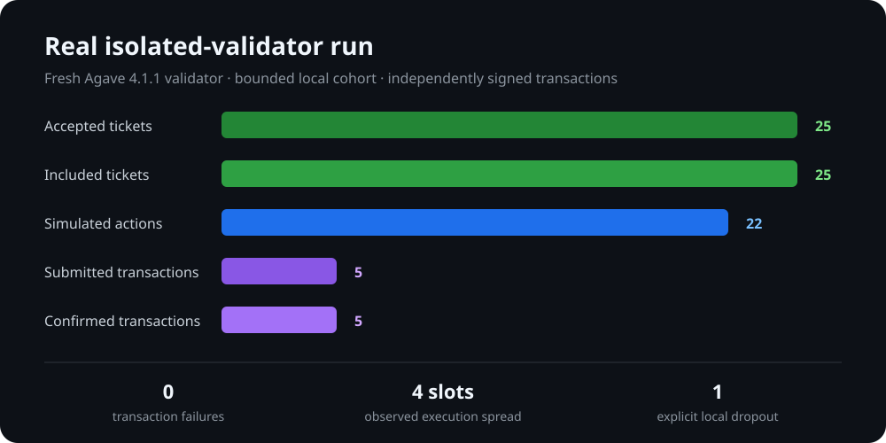
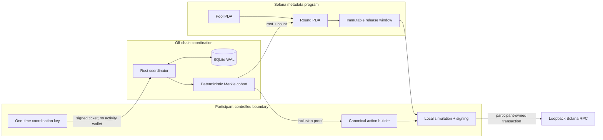
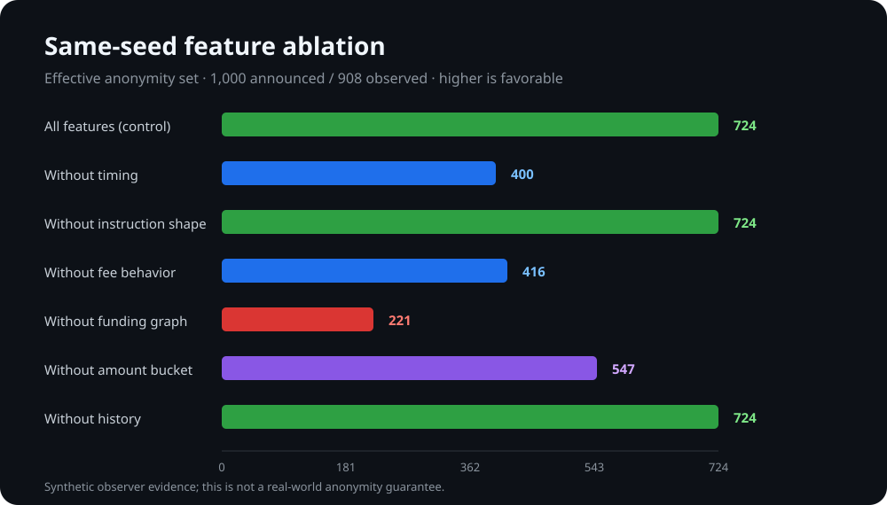

<div align="center">

# mirror-pool

### Privacy through coordinated behavior — without pooling funds

Rust-only infrastructure for independent Solana users to join a cohort, verify membership, and execute participant-owned actions inside the same bounded slot window.

[](https://github.com/lucascpas23/mirror-pool/actions/workflows/ci.yml)
[](rust-toolchain.toml)
[](docs/dependencies.md)
[](AUDIT.md)
[](LICENSE)

[Quick start](#quick-start) · [Verified results](#verified-results) · [Architecture](#architecture) · [Evidence](#reproducible-evidence) · [Security](SECURITY.md) · [Audit](AUDIT.md)

</div>

> [!IMPORTANT]
> mirror-pool coordinates timing and canonical instruction shapes. It is **not a mixer**, never takes custody of participant assets, and does not claim cryptographic anonymity or transaction unlinkability. This release is not audited or mainnet-ready.

Built for Superteam Brasil's [Privacy-Through-Noise bounty](https://superteam.fun/earn/listing/noise/).

## Why mirror-pool

Behavioral privacy is weakened when a wallet's timing, fees, instruction shape, funding graph, and repeated habits form a unique fingerprint. mirror-pool explores a narrow, measurable intervention: many independent wallets voluntarily execute compatible actions during the same public release window.

The protocol preserves participant control throughout:

- no deposits, withdrawals, pooled balances, shared signing keys, or recipient-hiding transfers;
- activity wallets are not required during cohort registration;
- every participant builds, simulates, signs, and sends their own transaction;
- the Solana program stores only bounded coordination metadata;
- the coordinator never receives participant private keys;
- arbitrary instructions and generalized participant-action CPI are prohibited.

## Verified results

The following results come from the checked-in Rust test suite, canonical synthetic evidence, and a fresh isolated Agave validator run recorded in [AUDIT.md](AUDIT.md).

| Validation | Result |
|---|---:|
| Workspace tests | **27 passed, 0 failed, 0 ignored** |
| Deterministic evaluation | **127 scenarios / 120 baseline rounds** |
| Evaluated scale | **10, 100, and 1,000 virtual participants** |
| Real local transactions | **5 submitted / 5 confirmed / 0 failed** |
| Local execution spread | **4 slots** |
| Restart recovery | **root and release schedule remained consistent** |
| Merkle benchmark | **1,000 leaves: 4,134 µs build / 1 µs proof / 37 µs verify** |
| SBF artifact SHA-256 | `7a1afcad85a6485fb14c1a550109dd76ddd495494a2f8ac014323cf3da90f555` |



The 22 simulations in the chart are deterministic evaluator actions; the five submitted transactions are a deliberately bounded real local cohort. Planned or simulated work is never reported as confirmed.

## Architecture



### Coordination backends

| Property | Transparent registry | Merkle cohort |
|---|---|---|
| Registration | Public one-time coordination key | Signed off-chain opaque ticket |
| On-chain membership exposure | Individual registration PDA | Root and accepted count only |
| Activity wallet required | No | No |
| Coordinator visibility | Public registration | Coordinator sees submitted tickets |
| Primary purpose | Honest synchronization baseline | Reduce premature on-chain membership exposure |
| Cryptographic wallet anonymity | No | No |

The Merkle backend domain-separates tickets and proofs, verifies Ed25519 signatures and expiry, rejects duplicate keys and commitments, sorts leaves deterministically, and makes sealed roots immutable.

## Privacy evaluation

The all-Rust evaluator models timing, instruction shape, fee behavior, funding relationships, amount buckets, dropouts, and longitudinal history. It compares both backends, four release strategies, narrow and wide windows, multiple seeds, and low/high dropout at three cohort scales.

| Metric | Canonical result | Interpretation |
|---|---:|---|
| 1,000-participant observed set | **631–964**, average **893.9** | Dropout prevents announced size from equaling observed size |
| Minimum normalized entropy | **0.792302** | Lower is unfavorable |
| Same-seed control effective set | **724.34 of 908 observed** | Synthetic behavioral equivalence, not anonymity |
| Minimum k-anonymity | **1** | Some fingerprints remain unique |
| Maximum unique-fingerprint rate | **1.0** | Worst cases remain fully distinguishable |
| Maximum classifier AUC | **1.0** | High AUC is explicitly unfavorable |



Removing funding-graph information caused the largest reduction in effective-set entropy in this same-seed ablation. This does not mean funding graphs improve privacy: it shows that metric interactions must be interpreted together. The raw adverse results are preserved in [evaluation.json](evidence/canonical/evaluation.json), not filtered out for presentation.

Read [the privacy model](docs/privacy-model.md), [adversarial evaluation notes](docs/adversarial-evaluation.md), and [threat model](docs/threat-model.md) before interpreting these numbers.

## Quick start

### Prerequisites

- Rust **1.89** via the checked-in `rust-toolchain.toml`;
- Solana/Agave CLI **4.1.x** for the real local validator demonstration;
- macOS or Linux for the canonical local workflow.

SQLite is bundled through the Rust dependency. Anchor, Node.js, TypeScript, Python, and Surfpool are not required.

```bash
git clone https://github.com/lucascpas23/mirror-pool.git
cd mirror-pool

cargo build --workspace --all-features
cargo test --workspace --all-features
cargo run -p mirror-pool-cli -- --help
```

### Safe virtual demonstration

No RPC or transaction sending is required:

```bash
cargo xtask demo
cargo run -p mirror-pool-cli -- evaluate \
  --participants 1000 --seed 42 --output evaluation.json
```

Expected dry-run distinction:

```text
virtual_participants=25 observed=22 ... confirmed_local_transactions=0
```

### Full isolated Solana demonstration

```bash
cargo xtask setup
cargo xtask full-demo
```

`full-demo` performs the complete real path:

1. builds the native SBF program;
2. creates a temporary loopback validator, keys, ledger, and SQLite database;
3. deploys the coordination program and creates pool/round PDAs;
4. accepts 25 signed tickets and verifies every inclusion proof;
5. publishes the root, seals the round, and schedules the release window;
6. simulates participant actions and confirms five independently signed transactions;
7. injects a dropout and restarts persistence during a second round;
8. verifies root/schedule consistency and sanitized evidence;
9. destroys all temporary wallets, keys, database files, and validator state.

## CLI workflow

Create validated local pool and round intent files. Writers use create-new semantics and refuse accidental overwrite.

```bash
cargo run -p mirror-pool-cli -- pool create \
  --output pool.json \
  --authority 11111111111111111111111111111111 \
  --minimum 10 --maximum 1000 --backend merkle

cargo run -p mirror-pool-cli -- pool inspect --config pool.json

cargo run -p mirror-pool-cli -- round open \
  --pool pool.json --output round.json \
  --rpc-url http://127.0.0.1:8899

cargo run -p mirror-pool-cli -- round inspect --config round.json
```

The CLI also provides `ticket create`, `ticket submit`, `proof verify`, `action prepare`, `action simulate`, guarded `action execute`, `observe`, `evaluate`, `report`, `evidence`, `doctor`, and `coordinator run`. Run any command with `--help` for its noninteractive interface.

Pool/round CLI files are validated intent, not false on-chain submission claims. Fixed on-chain administration builders live in `mirror-pool-client` and are exercised by `full-demo`.

## Safety controls

Sending fails closed unless every relevant condition is satisfied:

- loopback RPC by default;
- explicit `--confirm` and `--enable-sending` acknowledgements;
- successful simulation before submission;
- active immutable execution window;
- allowlisted template and program ID;
- bounded transaction size, compute units, priority fee, and total fee;
- bounded cohort and concurrent-send limits;
- canonical Memo shape for the implemented direct-send path.

Ticket expiry uses a coordinator-owned confirmed-commitment RPC clock. Clients cannot submit their own observed slot; admission returns HTTP 503 if that trusted clock is unavailable.

## Test and supply-chain gates

| Gate | Command | Status |
|---|---|---:|
| Formatting | `cargo fmt --all -- --check` | Passed |
| Static analysis | `cargo clippy --workspace --all-targets --all-features -- -D warnings` | Passed |
| Unit/property/integration/recovery | `cargo test --workspace --all-features` | 27 passed |
| Documentation tests | `cargo test --doc --workspace` | Passed |
| Optimized build | `cargo build --workspace --all-features --release` | Passed |
| RustSec | `cargo audit` | Passed with one documented allowed transitive warning |
| Dependency policy | `cargo deny check` | Passed |
| SBF and local validator | `cargo xtask full-demo` | Passed |
| Evidence integrity | `cargo xtask verify-evidence --directory evidence/canonical` | Passed |

The allowed RustSec warning is Solana's transitive unmaintained `bincode 1.3.3` (`RUSTSEC-2025-0141`); no compatible safe replacement exists in the pinned Solana 4.0 client dependency graph. See [dependency decisions](docs/dependencies.md).

## Reproducible evidence

Generate a fresh package and independently verify its manifest:

```bash
cargo xtask evaluate --output evidence/generated
cargo xtask verify-evidence --directory evidence/generated
```

The canonical package contains 127 deterministic scenarios in JSON, CSV, and Markdown. The verifier checks versions, file presence, BLAKE3 checksums, transaction-count consistency, and secret/path patterns.

| Artifact | BLAKE3 |
|---|---|
| `evaluation.json` | `fec1c32023254260bbee6aebd0a3119f7161eaf0bde2a45a137cb784d86a10b6` |
| `evaluation.csv` | `bca8e073375cba32f4bfca9afb1be1c8fec2c5543fb4c8dd86af1c82f5b17c0c` |
| `evaluation.md` | `26bd8b70c4c0d79edf08c86d601ded1943ec836e5592e9d8065e77b897760db2` |

## Workspace

| Package | Responsibility |
|---|---|
| `mirror-pool-core` | Domain model, configuration integrity, checked state machine |
| `mirror-pool-crypto` | Signed one-time tickets and secret-safe types |
| `mirror-pool-merkle` | Deterministic cohort and inclusion proofs |
| `mirror-pool-actions` | Four bounded templates and central safety policy |
| `mirror-pool-store` | SQLite WAL, migrations, immutable roots and schedules |
| `mirror-pool-coordinator` | Bounded Axum API and swappable backend trait |
| `mirror-pool-client` | Typed SDK, PDA/instruction builders, guarded local execution |
| `mirror-pool-simulator` | Virtual-time synchronization and adversarial metrics |
| `mirror-pool-program` | Native bounded Solana metadata program |
| `mirror-pool-cli` | Participant and operator command surface |
| `xtask` | Setup, localnet demonstration, evaluation, and evidence verification |

## Limitations

- A single coordinator can observe tickets, censor participants, or delay publication.
- Activity wallets, transaction parameters, RPC metadata, and funding graphs remain observable.
- Small cohorts, dropouts, and longitudinal observation weaken effective privacy.
- Direct transaction execution currently supports only the canonical bounded Memo template; token and stake templates are preparation/simulation extension points.
- The full negative program matrix is not run through stable `solana-program-test` because a compatible stable 4.x release was unavailable.
- Federation, threshold root signing, ZK membership, production key management, and mainnet readiness are not implemented.

See the complete [implementation audit](AUDIT.md) for tested and untested paths.

## Responsible use

Do not use mirror-pool for fund mixing, money laundering, market manipulation, wash trading, governance abuse, airdrop farming, illegal evasion, or unauthorized third-party activity. Review [responsible use](docs/responsible-use.md) and [operations](docs/operations.md) before running the coordinator.

Contributions are welcome under [CONTRIBUTING.md](CONTRIBUTING.md). Security reports should follow [SECURITY.md](SECURITY.md). Licensed under [MIT](LICENSE).
